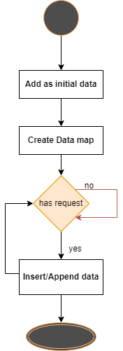

# tcb_homework_api
Homework interview

# Thank you for reading this instruction
### This instruction includes:
* Describe about logic flow and answer requirements
* Deploy and run code
* Others

## 1. Describe about logic flow and answer requirements:
### a. Flow:

Users can navigate to 3 endpoints:
* The first one receives data from user with below format:
```json
  {
     "poolId": 123546,
     "poolValues": [
        1, 7, 2, 6
     ]
  }
  ```
if Pool is not existed in the application, we have to add this request and return "inserted".

if Pool is existed in the application, we have to append all values in new request to existed one and return "appended".
Sample:
```json
{
  "status": "appended"
}
```
request (POST): http://localhost:8080/createPool

---

* The second one receives data from user with below format:
```json
{
   "poolId": 123546,
   "percentile": 50
}
```
The request will return 2 values, one is the calculated quantile of pool which have poolId as provided in this request and combine with the rate "percentile", and other is number of elements in pool.

ref: https://www.indeed.com/career-advice/career-development/how-to-calculate-percentile-rank

If poolId does not exist, it will return error.
Sample:
```json
{
  "calculatedQuantile": 2,
  "elementCount": 4
}
```
request (POST): http://localhost:8080/query

---

The last one (additional) is developed as GET method for checking pool elements (sorted) with provided poolId:

request: http://localhost:8080/getPool?poolId=123456
output:
```json
{
    "poolId": 123456,
    "poolValues": [
        1,
        2,
        6,
        7
    ]
}
```

---

### b. Answer question as required in email:
##### % *the response from the append is a status field confirming "appended" or "inserted".*
> Discuss as above
##### % *the response from the query has two fields: the calculated quantile and the total count of elements in the pool*
> Discuss as above
##### % *please do not use a library for the quantile calculation if a pool contains less than 100 values.*
> Use Java as native
##### % *focus on high performance if possible (time permitting) and resiliency*
> Application runs with further requests and data (old and new) are stored in ConcurrentHashMap which interface provides Multiple access for storing data and on RAM.
##### % *reasoning about high-availability and scalability is a nice-to-have*
> Because it used SpringBoot and Java technology for developing, so It can be deployed wit HA and scalability.
##### % *no database; no connection to anything needed. Keep it simple.*
> no database; no connection
##### % *your preferred language.* 
> Java - SpringBoot

Dataflow diagram:



## 2. Deployment and Run
*I prepared 2 ways to run this application:*
* *Java 8 native*

**Please navigate to tcbhw-api directory before follow instruction!**

### a. Java 8 native:
If your OS has the Java 8 environment and Maven build tools, you just have to run the file:
> *run_using_local_env.sh*

by using command:
```shell
sh run_using_local_env.sh
```
it will take time for downloading some Java and Spring libraries.


## 3. Testing

After RESTApi server started, there are 2 ways to test API, which are:
* **Tools as Postman, curl**
* **Swagger UI v3**   - *I embedded it in application*

#### Tools:
```

```

```


#### Swagger UI:
```


###  *Thank you so much for testing this application*
### *If you have any question or doubt, please PM via HR!*
